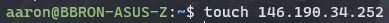
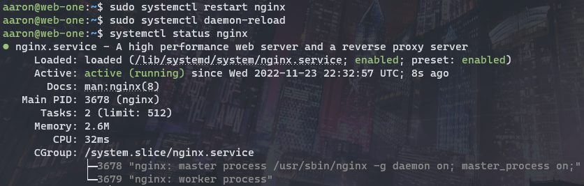
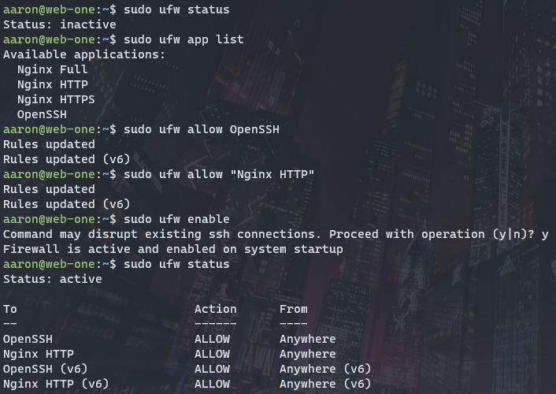

# ACIT 2420 Week 12 Lab

## Repository

### Team Members

  - *Munib Javed A01221306*
  - *Aaron Zhang A01316218*

### File Structure

## Step 1

Install nginx:

## Step 2

Create **index.html**:

Write something to serve in index.html:

## Step 3

Create nginx server block file, and write the server block:

**Note**: replace the IP addresses shown here with your site domain.

## Step 4

Upload the files from steps 2 and 3 to your server (we used sftp here):

Move `index.html` to `/var/www/<ip>/html/`:

Move the server block file to `/etc/nginx/sites-available`:

Create new soft link to server block, test nginx configuration, and restart nginx service:

## Step 5

Restart the nginx service:

## Step 6

Visit your server IP in a browser. The contents of `index.html` should be served successfully.

## Step 7

Setup firewall using UFW and allow incomming SSH + HTTP connections:

## Step 8

Ensure you are still able to connect to server via both SSH and HTTP in browser.
